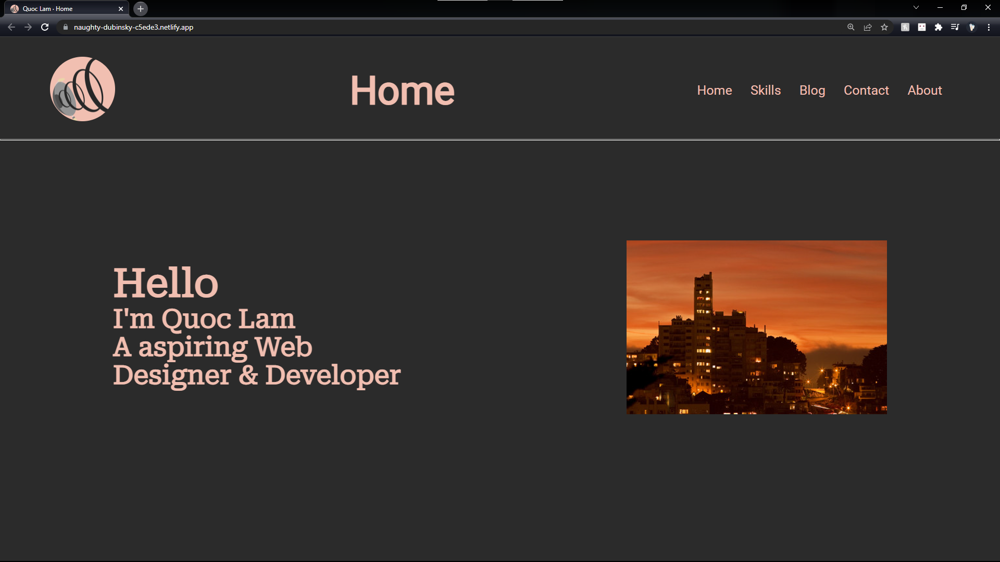
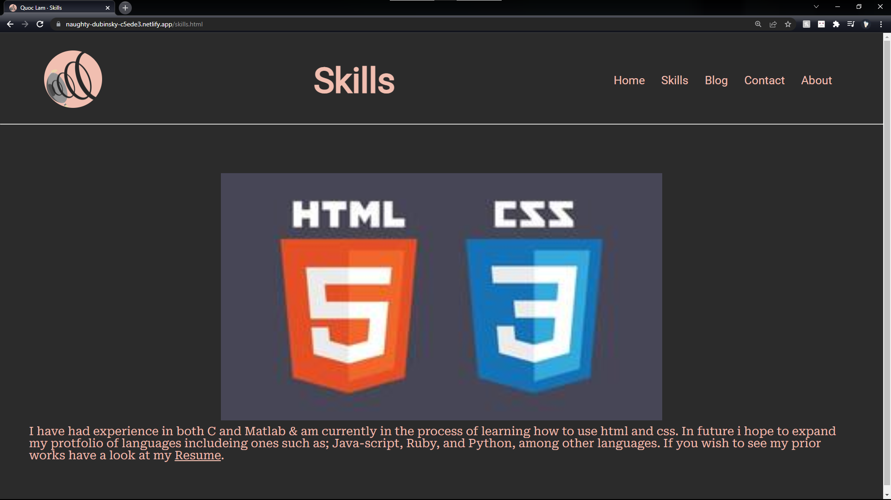
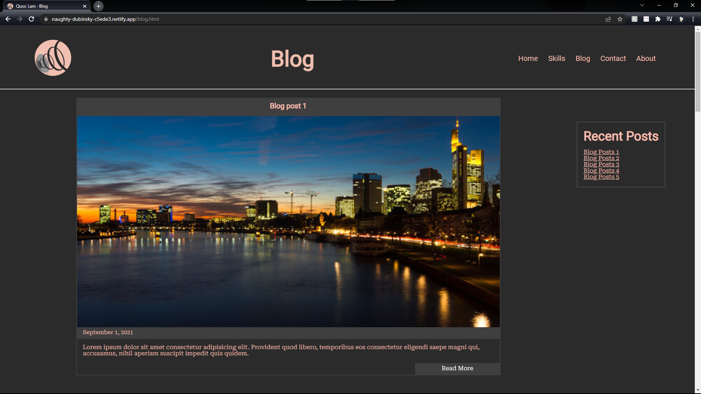
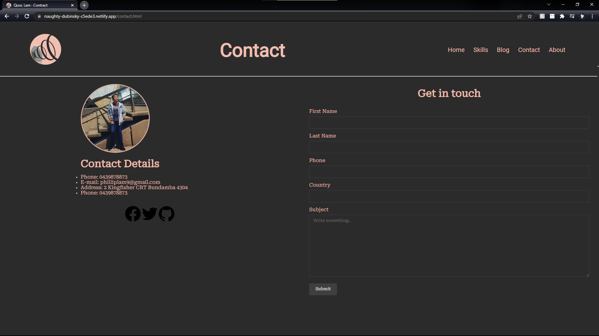
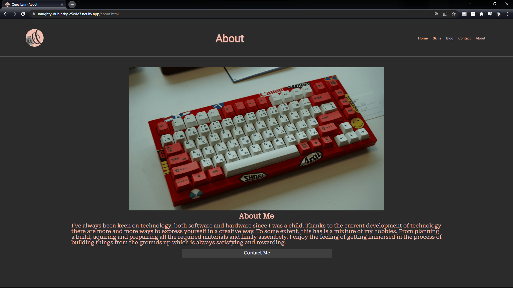

# Assignment T1A2

[link](https://naughty-dubinsky-c5ede3.netlify.app/) to site.

[link](https://github.com/Wokko-wok/QuocLam_T1A1) to github.

## Purpse & Features
The purpose of the site is to display my talent, abilities, and experience in coding. The portfolio features a blog, Contact information, my current skills, and a bit of information about myself. This site is (hopefully) accessible for all devices from mobile to pc.

## Sitemap/wire frame

This is a sitemap of the website which has not changed from the initial mock-up.

After the creation of the sitemap came the wireframes. This is just an example of how the wireframes were laid out for the pages shown in the sitemap.

## Screenshots

## Target Audience
The Target audiences are potential clients and employers

## Tech Stack
The site consists of only HTML and CSS. In the future, I would like to add the use of Javascript.

Currently deployed on Netlify which might change in the future.